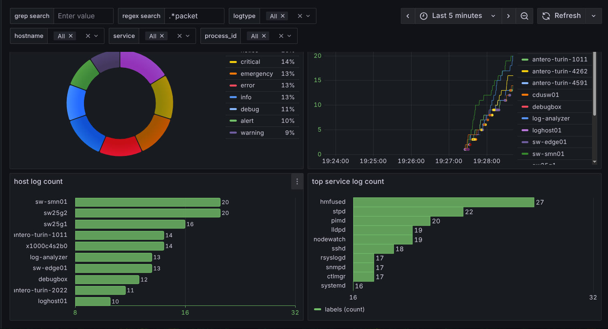
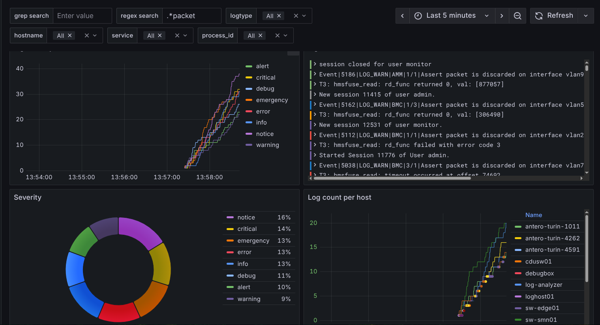
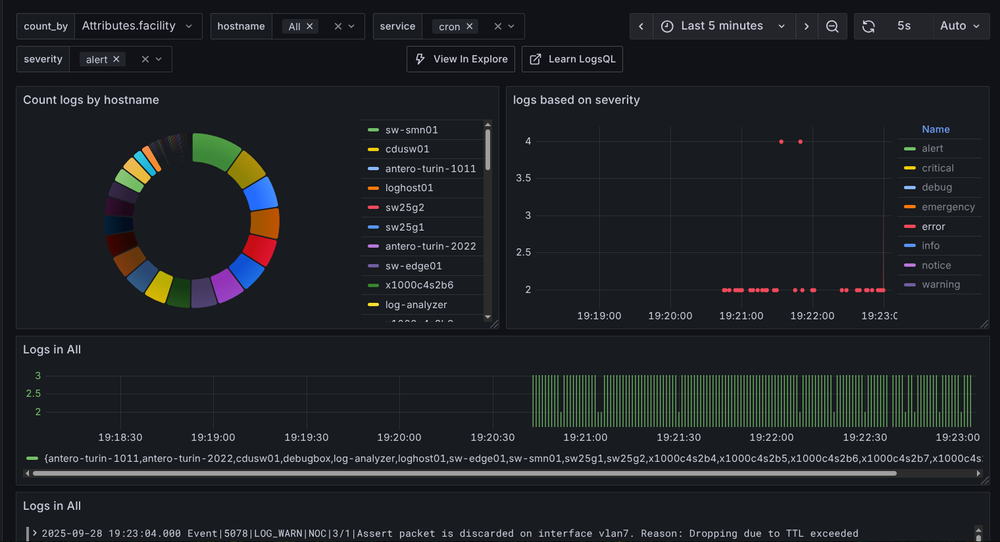
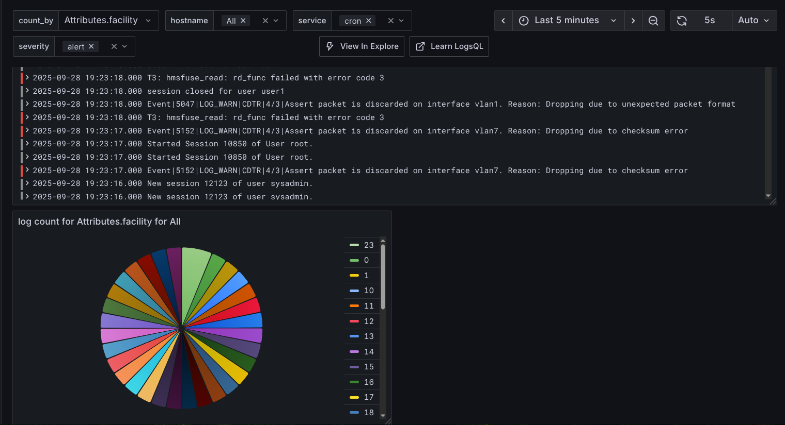

# HPE CPP 2025 – HPCM Logs with Grafana Loki & VictoriaLogs

This project is developed as part of the **HPE CPP 2025 initiative**, focused on implementing **log observability and visualization** at scale for HPE's massive server infrastructure. Named **HPCM Logs**, the solution is designed to enable efficient collection, processing, aggregation, and querying of logs using open-source observability tools like **Fluent Bit**, **Apache Kafka**, **Logstash**, **Grafana Loki**, **VictoriaLogs**, and **Grafana**.

---

## 🧩 Project Architecture Overview

Logs from various sources are streamed through a pipeline of industry-standard tools to ensure scalability, reliability, and easy visualization:

1. **[Fluent Bit](https://fluentbit.io/)** – Lightweight log collector and forwarder  
2. **[Apache Kafka](https://kafka.apache.org/)** – Message queue for buffering and scalable distribution  
3. **[Logstash](https://www.elastic.co/logstash)** – Optional log processor and modifier  
4. **[Grafana Loki](https://grafana.com/oss/loki/)** / **[VictoriaLogs](https://docs.victoriametrics.com/victorialogs/)** – Log aggregation and storage backends  
5. **[Grafana](https://grafana.com/)** – Dashboard for querying and visualizing logs  

---

## ⚙️ Prerequisites

Make sure the following tools are installed on your Linux system:

Fluent Bit
Apache Kafka
Logstash
Grafana Loki or VictoriaLogs
Grafana

## 🚀 Getting Started

📝 Note: The exact paths may vary depending on where you've cloned or installed each tool. Adjust paths as needed.

🔹 **Step 1: Start Fluent Bit:**
This step collects logs and forwards them to Kafka.
fluent-bit -c ./fluentbit/fluent-bit.conf
Make sure fluent-bit.conf is configured correctly with source paths and Kafka topic mappings.

🔹 **Step 2: Start Apache Kafka**

🔹 **Step 3: Start Logstash:**
Logstash can modify logs, extract fields, or enrich data before forwarding to Loki or VictoriaLogs.
logstash -f ./logstash/logstash.conf

🔹 **Step 4: Start Log Aggregator:**
Choose one of the following:
 - **Option A: Grafana Loki**
./loki -config.file=./loki/loki-config.yaml
 - **Option B: VictoriaLogs**
./vmlogs-prod -config=./vmlogs/vmlogs.yaml

**🔹 Step 5: Start Grafana:**
Visit http://localhost:3000 and:
Add Loki or VictoriaLogs as a data source
Import the dashboard provided in the repo and visualize

---

## Images
### Loki Dashboard

### Victoria Dashboard

